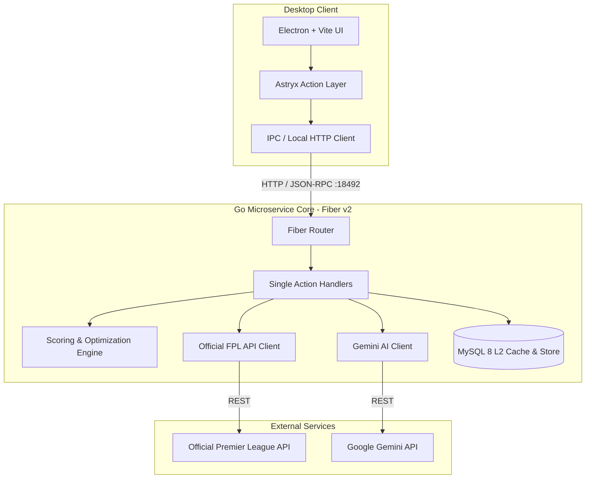

# ⚽ Fantasy Premier League (FPL) Assistant — 2026/2027 Season

[](https://golang.org)
[](https://gofiber.io)
[](https://www.electronjs.org/)
[](https://vitejs.dev/)
[](https://www.mysql.com/)
[](https://aistudio.google.com/)

A high-performance, AI-augmented **Fantasy Premier League (FPL) Assistant** desktop application and microservice suite designed for the 2026/2027 season.

The system combines a blazing-fast **Go (Fiber v2)** analytical backend with an **Electron + Vite** desktop client styled with the bespoke **Astryx Design System** (Dark / Neon aesthetic), backed by MySQL persistence and Google Gemini AI insights.

---

## 🌟 Key Features

- **🚀 Real-Time FPL Data Sync & Caching**: Connect any FPL Manager Team ID to pull live team picks, bank balances, transfers, chip statuses, and global bootstrap data. Features multi-tier caching (L1 in-memory + L2 MySQL persistence) with stampede protection.
- **📊 Algorithmic Projections & xP Engine**: Advanced projected points calculation factoring in fixture difficulty rankings (FDR), form, home/away advantage, and historical returns.
- **🧠 AI-Powered Insights (Gemini 2.0)**:
  - **AI Team Suggestions**: Strategic transfer recommendations with tactical rationales and chip suggestions.
  - **AI Improvement Analysis**: Post-deadline and gameweek retrospectives highlighting strengths, vulnerabilities, and captaincy risks.
- **📋 Lineup & Transfer Optimizer**: Solves starting XI formations (3-5-2, 3-4-3, 4-4-2, 4-3-3, 5-3-2, etc.), auto-selects optimal captains/vice-captains, and orders bench players by expected value.
- **🏥 Availability & Injury Tracking**: Live news alerts, injury flags, suspension notices, and chance of playing percentages.
- **📈 Gameweek Score Tracking**: Persistent recording of actual gameweek scores, historical trends, and assistant model accuracy over time.
- **🎨 Astryx Design System**: Neon-accented dark UI with smooth micro-animations, glassmorphism, responsive data grids, and strict tokenized styling.

---

## 🏗️ Architecture



### Architectural Principles

- **Single Action File Pattern**: Every endpoint and domain capability is contained in a single, focused file containing its Input DTO, Output DTO, Action struct, and `Execute()` method.
- **Fail-Safe Operation**: In-memory cache fallback enables offline and standalone operation even if MySQL or AI keys are unavailable.

---

## 📂 Project Structure

```text
├── backend/
│   ├── cmd/server/          # Application entrypoint (main.go)
│   ├── internal/
│   │   ├── actions/         # Single Action handlers (Fiber endpoints)
│   │   ├── ai/              # Google Gemini AI client & prompt builder
│   │   ├── config/          # Environment configuration loader
│   │   ├── db/              # MySQL schema migrations & query handlers
│   │   ├── fpl/             # Official FPL API client & models
│   │   └── scoring/         # xP projections & lineup optimizer engine
│   ├── Dockerfile           # Multi-stage Go production container
│   └── go.mod
├── frontend/
│   ├── electron/            # Electron main process & IPC bridges
│   ├── src/
│   │   ├── actions/         # Single Action client-side calls
│   │   ├── assets/          # Stylesheets (Astryx design tokens & base CSS)
│   │   └── components/      # UI components (Pitch view, transfers, AI cards)
│   ├── index.html
│   ├── package.json
│   └── vite.config.js
├── scripts/
│   └── db/
│       └── init.sql         # Initial MySQL schema (users, cache, history)
├── docker-compose.yml       # Docker Compose setup (Backend + MySQL)
├── .env.example             # Comprehensive environment variable template
└── AGENTS.md                # AI agent instructions & workspace rules
```

---

## ⚡ Quick Start

### Prerequisites

- **Go**: `1.22` or higher
- **Node.js**: `v18+` and `npm`
- **Docker & Docker Compose** (optional, for containerized deployment)
- **Gemini API Key** (optional, get free at [Google AI Studio](https://aistudio.google.com/app/apikey))

---

### Option 1: Running with Docker Compose (Recommended for Backend)

1. **Clone the repository**:

   ```bash
   git clone git@github.com:Adroit11/Fantasy-Premier-League-Assistant.git
   cd Fantasy-Premier-League-Assistant
   ```

2. **Configure environment variables**:

   ```bash
   cp .env.example .env
   ```

   _(Optionally add your `GEMINI_API_KEY` to `.env` for AI features)._

3. **Start backend and database services**:

   ```bash
   docker compose up -d
   ```

4. **Verify backend health**:

   ```bash
   curl http://localhost:18492/health
   ```

5. **Start the Frontend desktop app**:
   ```bash
   cd frontend
   npm install
   npm run dev      # or npm start for Electron
   ```

---

### Option 2: Running Locally (Manual Setup)

#### 1. Backend Setup

```bash
cd backend
go mod download
go run cmd/server/main.go
```

The server will start on `http://127.0.0.1:18492`.

#### 2. Frontend Setup

```bash
cd frontend
npm install

# Start Vite dev server in browser
npm run dev

# Or launch as Electron desktop application
npm start
```

---

## ⚙️ Environment Variables

Key variables defined in [`.env.example`](file:///.env.example):

| Variable                | Default                                 | Description                                 |
| ----------------------- | --------------------------------------- | ------------------------------------------- |
| `PORT` / `BACKEND_PORT` | `18492`                                 | HTTP port for the Go server                 |
| `BIND_HOST`             | `127.0.0.1`                             | Network host to bind (`0.0.0.0` in Docker)  |
| `FPL_BASE_URL`          | `https://fantasy.premierleague.com/api` | Base URL for the official FPL API           |
| `CACHE_TTL_MINUTES`     | `60`                                    | In-memory cache lifetime for bootstrap data |
| `DB_ENABLED`            | `true`                                  | Enable MySQL L2 persistent cache            |
| `DB_HOST`               | `127.0.0.1` (`mysql` in Docker)         | Database hostname                           |
| `DB_PORT`               | `3306`                                  | Database port                               |
| `DB_USER`               | `root` / `fpl_user`                     | Database user                               |
| `DB_PASSWORD`           | `fpl_secret`                            | Database password                           |
| `DB_NAME`               | `fpl_assistant`                         | Database schema name                        |
| `GEMINI_API_KEY`        | _(optional)_                            | Google Gemini API Key for AI features       |
| `AI_MODEL`              | `gemini-2.0-flash`                      | Gemini model name                           |
| `VITE_BACKEND_URL`      | `http://127.0.0.1:18492`                | Backend endpoint accessed by frontend       |

---

## 📡 API Endpoints Overview

| Method | Endpoint                          | Description                                           |
| ------ | --------------------------------- | ----------------------------------------------------- |
| `GET`  | `/health` / `/healthz`            | Service healthcheck                                   |
| `POST` | `/api/v1/team/connect`            | Connect manager team ID and retrieve team status      |
| `POST` | `/api/v1/team/overview`           | Fetch team picks, chips, and current standings        |
| `POST` | `/api/v1/availability/news`       | Get injury, suspension, and availability updates      |
| `POST` | `/api/v1/projections/calculate`   | Calculate expected points (xP) for upcoming gameweeks |
| `POST` | `/api/v1/lineup/suggest`          | Get optimal Starting XI and captaincy recommendations |
| `POST` | `/api/v1/transfers/suggest`       | Calculate transfer targets based on projected value   |
| `POST` | `/api/v1/ai/team-suggestion`      | Generate AI-driven tactical transfer advice           |
| `POST` | `/api/v1/ai/improvement`          | Generate AI-driven team critique and risk analysis    |
| `POST` | `/api/v1/scores/record`           | Save gameweek score performance to history            |
| `GET`  | `/api/v1/scores/history/:team_id` | Retrieve historical gameweek results for a team       |

---

## 🧪 Testing

### Backend Tests

```bash
cd backend
go test -v ./...
```

---

## 📄 License

This project is licensed under the MIT License — see the [LICENSE](LICENSE) file for details.
